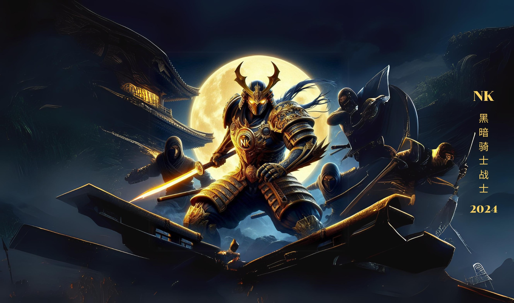

# Samurai 2 Player Fighting Game

Welcome to the Samurai 2 Player Fighting Game! This game lets two players compete as samurais in a head-to-head fighting match.

## Features

- **Two Player Gameplay**: Face off against a friend in a thrilling samurai battle.
- **Retro Design**: Experience a nostalgic aesthetic with 8-bit inspired graphics and fonts.
- **Responsive Controls**: Move and attack using intuitive keyboard controls.

## Gameplay

- **Objective**: Defeat your opponent by depleting their health bar using a combination of moves and attacks.
- **Controls**: Each player uses different keys to perform actions.

### Player 1 Controls

- **W Key**: Jump
- **A Key**: Move Left
- **D Key**: Move Right
- **Spacebar**: Attack

### Player 2 Controls

- **Up Arrow**: Jump
- **Left Arrow**: Move Left
- **Right Arrow**: Move Right
- **Down Arrow**: Attack

## Getting Started

To start playing:

1. Open the `index.html` file in your web browser.
2. Click on the "Start Game" button to begin the match.

## Installation

No installation required! Just open the `index.html` file in a modern web browser to play.

## Development

### Prerequisites

- A web browser that supports HTML5 and CSS3.

### Built With

- **HTML**: The structure of the game interface.
- **CSS**: The styling of the game, including the background and text formatting.
- **JavaScript**: (Future Enhancements) Will handle the game logic and interactivity.

### Running the Game Locally

1. Download or clone the repository.
2. Navigate to the project directory.
3. Open `index.html` with a web browser.

## Contributing

Feel free to contribute to the project. Please follow these steps:

1. Fork the repository.
2. Create your feature branch: `git checkout -b feature/newFeature`.
3. Commit your changes: `git commit -m 'Add some feature'`.
4. Push to the branch: `git push origin feature/newFeature`.
5. Open a pull request.

## Authors

- **Worachat W,Dev.** - *Initial Work*

## License

This project is licensed under the MIT License - see the [LICENSE](LICENSE) file for details.

## Acknowledgments

- Inspired by classic 2D fighting games.
- Font: 'Press Start 2P' by Google Fonts.

## Screenshots

## Contact

For any inquiries or issues, please contact me.!

---

Enjoy the game and have fun battling with your friends!

### Additional Notes
- Replace `[Your Name]` and `[Your Email]` with your actual name and email address.
- Include a `LICENSE` file if you choose to add licensing information.
- The `index.html` file should be the main entry point for the game. If there are additional setup steps or dependencies, include them in the "Getting Started" or "Installation" sections.
- Ensure the `./images2/background.jpg` path is correct for the screenshot or provide an appropriate image path.
